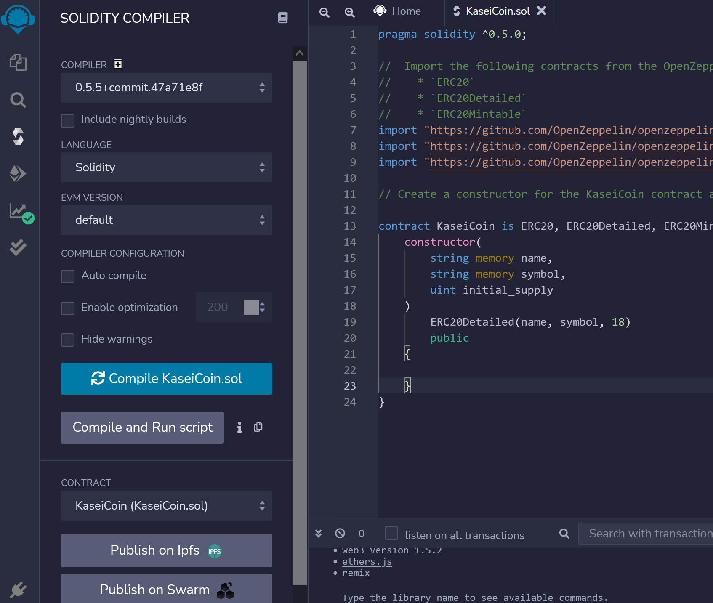
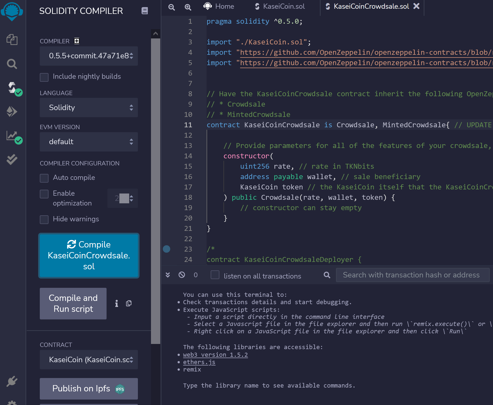
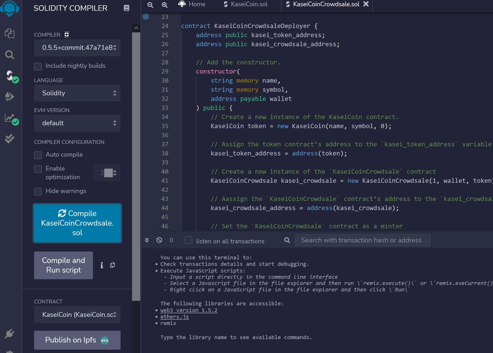
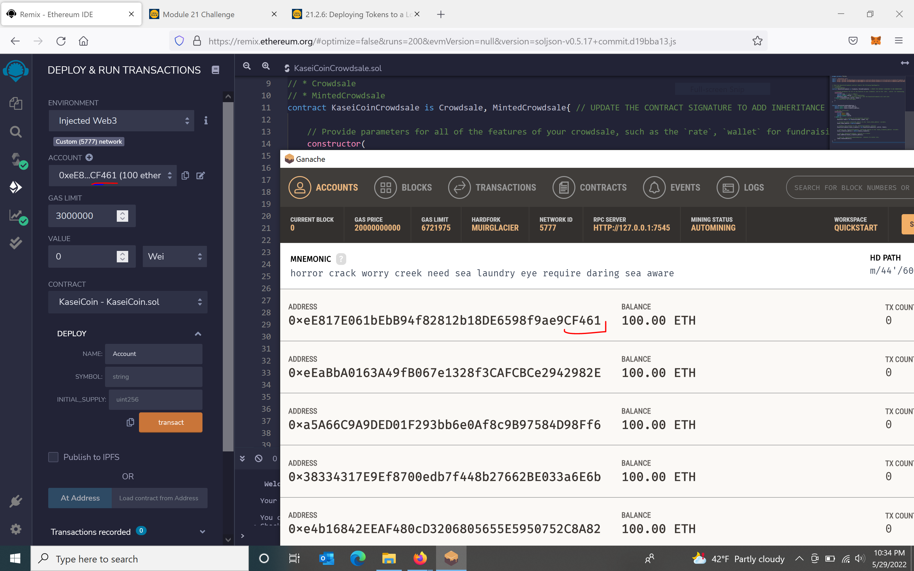
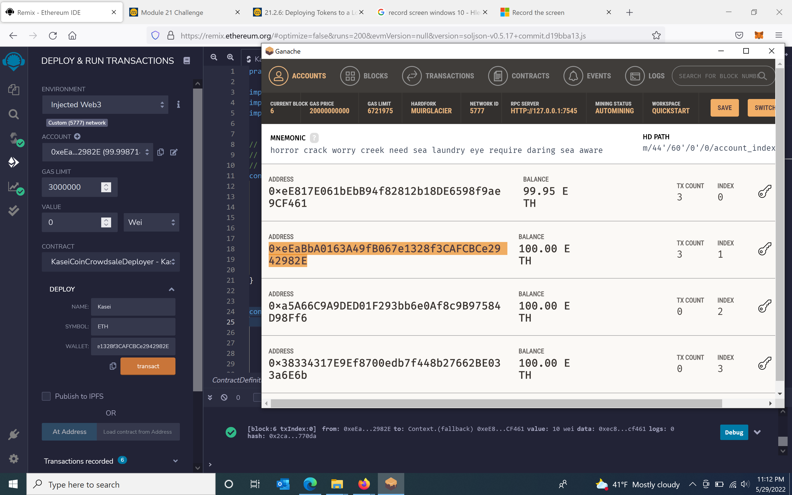
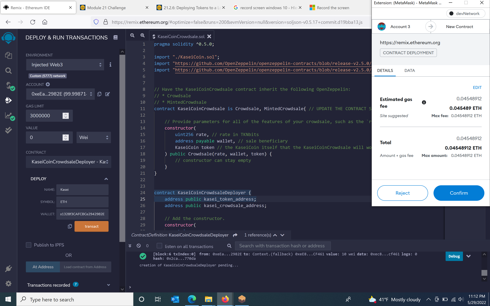
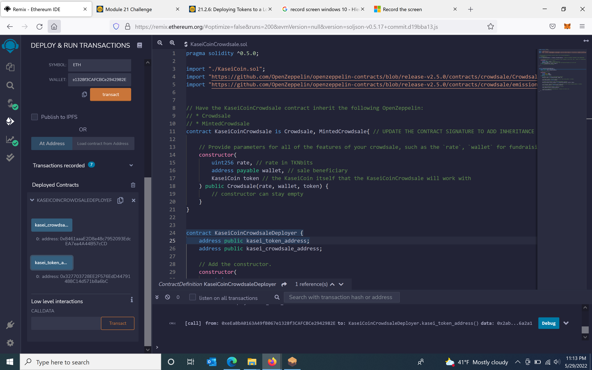

# KaseiCoin_Crowdsale

The goal of this project is to create a fungible token that is ERC-20 compliant and that will be minted by using a Crowdsale contract from the OpenZeppelin Solidity library. The crowdsale contract will manage the entire crowdsale process, allowing users to send ether to the contract and in return receive KAI, or KaseiCoin tokens. The contract mints the tokens automatically and distributes them to buyers in one transaction.

---

## Technologies

For this project we will use the following tolls:

* [Ganache](https://trufflesuite.com/ganache/) - a personal Ethereum blockchain which you can use to run tests, execute commands, and inspect state while controlling how the chain operates

* [Remix IDE](https://ethereum.github.io/remix-ide/) - is an open source web and desktop application

* [MetaMask](https://decrypt.co/resources/metamask) - is a cryptocurrency wallet that enables users to access the Web 3 ecosystem of decentralized applications

* [Solidity](https://docs.soliditylang.org/en/v0.8.14/) - is an object-oriented, high-level language for implementing smart contracts

---

## Evaluation Evidence

---

## Contributors

Author: Magdalena Svimberska
email: magdalena.svimberska@gmail.com

---

## License

GNU General Public License